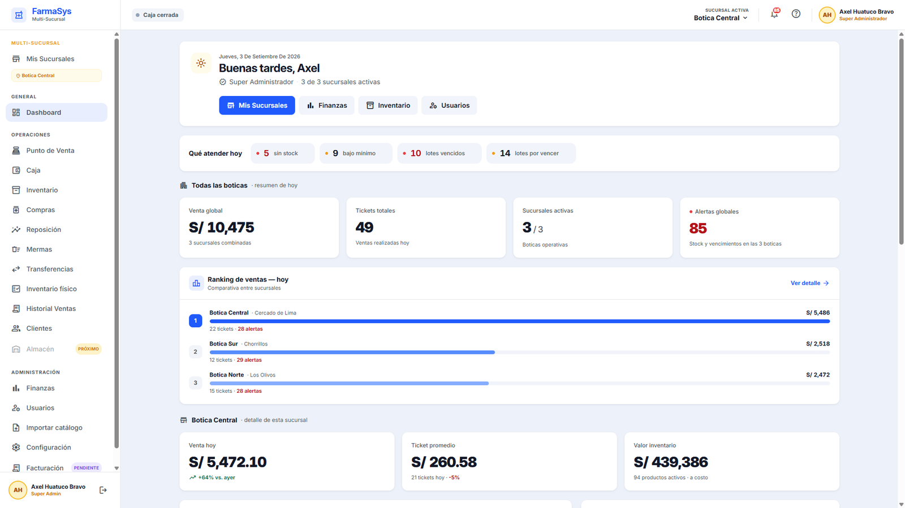
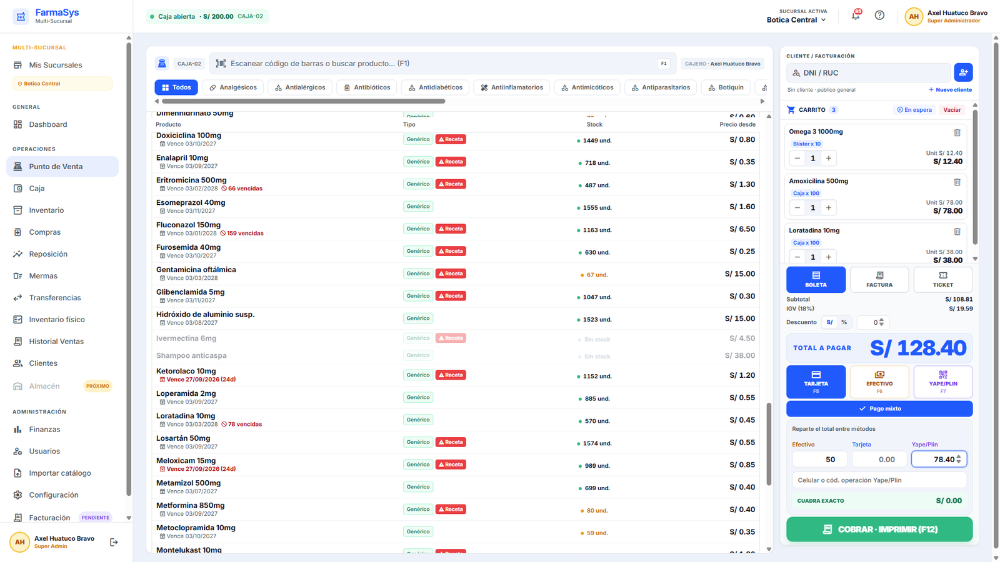
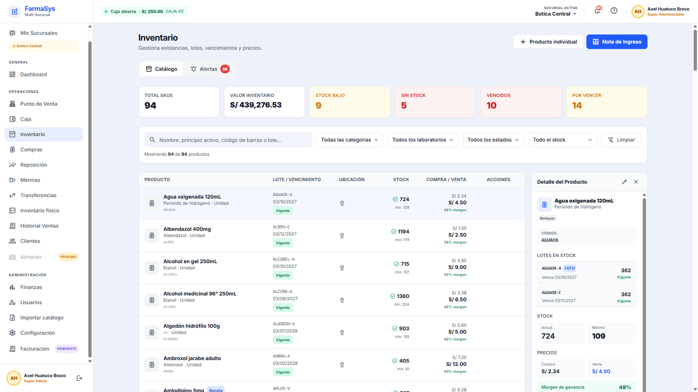
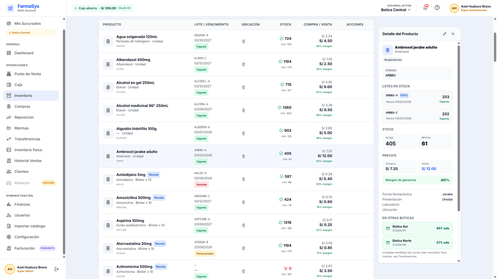
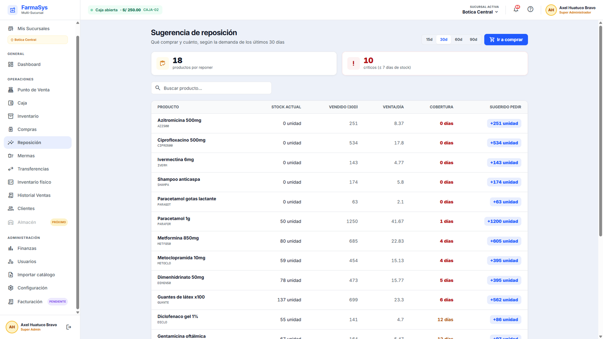
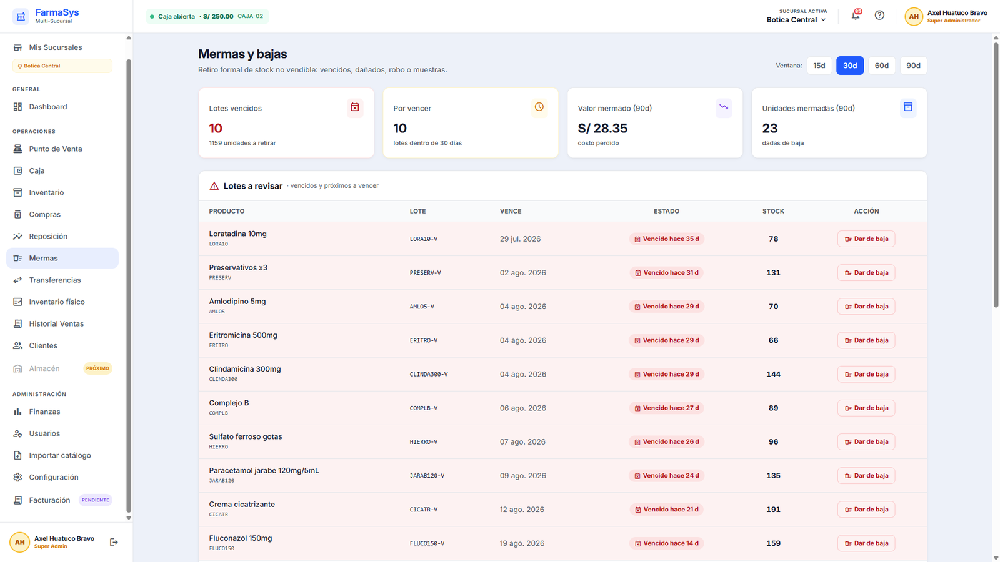
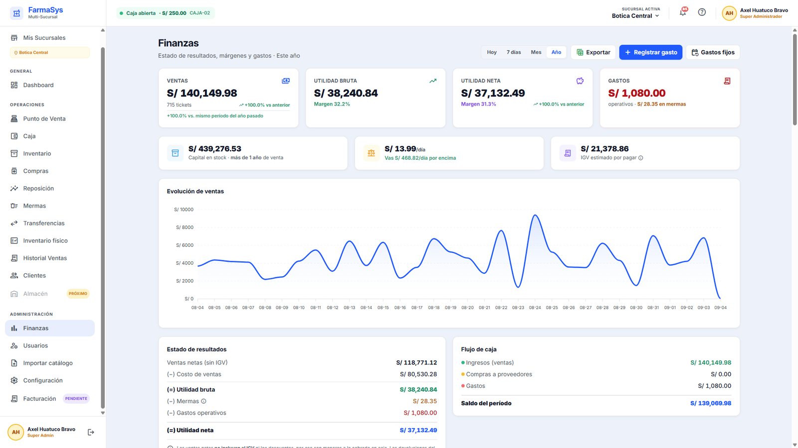

# FarmaSys — Sistema de gestión para cadena de boticas

Punto de venta, inventario por lotes, caja y contabilidad operativa para una
cadena de farmacias con varias sedes. Angular 21 + NestJS 10 + PostgreSQL.

> Proyecto real, desarrollado para una cadena de 5 boticas en Perú.
> Este repositorio incluye una **semilla de demostración** con datos ficticios
> para poder levantarlo y recorrerlo completo: ver [`demo/README.md`](demo/README.md).



> ### ⚖️ Código propietario — no es open source
>
> © 2026 Axel Huatuco Bravo. Todos los derechos reservados.
>
> Se publica para **lectura y evaluación profesional**. Está permitido leer el
> código, clonarlo y ejecutarlo localmente para evaluarlo. **No** está permitido
> usarlo con fines comerciales, redistribuirlo ni crear obras derivadas sin
> autorización escrita — ver [`LICENSE`](LICENSE).
>
> Obra registrada. Para solicitar permisos: **axelhdev@gmail.com**

---

## El problema

Una botica no es una tienda cualquiera. Vende **lotes con fecha de vencimiento**,
en **unidades distintas del mismo producto** (caja, blíster, pastilla suelta), con
**medicamentos que exigen receta**, y su margen real depende de a qué precio
compró cada lote — no del precio de la lista de hoy.

Multiplicado por cinco locales, aparecen problemas que un CRUD no resuelve:
qué sede tiene lo que a otra le falta, quién movió el stock que no cuadra, y
cuánto gana cada botica de verdad una vez descontadas mermas y gastos.

---

## Decisiones técnicas que vale la pena mirar

**FEFO — se despacha primero lo que vence antes.**
Vender no es restar de un número. El sistema recorre los lotes ordenados por
vencimiento, ignora los vencidos, y deja constancia de qué lote salió en cada
venta. Eso permite reingresar una devolución **a su lote original**, no al más
reciente.
→ [`inventario.service.ts`](backend/src/inventario/inventario.service.ts)

**Costo promedio ponderado, y congelado al vender.**
Cada compra recalcula el costo del stock. Al vender, ese costo se **copia** en la
línea de venta. Sin eso, el margen histórico cambia solo cuando el proveedor sube
precios: las ventas del año pasado "perderían" utilidad sin que nadie tocara nada.

**Dos reglas de aislamiento por sucursal, no una.**
Un encargado de sede administra su botica; el dueño ve las cinco. Pero el estado
de resultados no es lo mismo que el inventario: hay una regla común y otra
**financiera**, más estricta, que solo el dueño cruza.
→ [`scope-sucursal.util.ts`](backend/src/auth/scope-sucursal.util.ts)

**Todo lo que mueve stock y plata va en una transacción.**
Una venta descuenta lotes, actualiza el stock agregado, escribe el kardex, genera
el correlativo del comprobante y registra el pago. O pasa todo, o no pasa nada.
Con clave de idempotencia, para que un doble clic no cobre dos veces.

**Tres rastros de auditoría.** Quién movió mercadería (kardex), quién entró al
sistema, y quién cambió un ajuste — con valor anterior y nuevo, escrito en la
misma transacción que el cambio.

---

## Bugs encontrados y corregidos

Auditando el código propio, con su impacto en dinero. Es la parte del proyecto
de la que más aprendí.

**El costo no viajaba en las transferencias.**
Mover mercadería entre boticas trasladaba las unidades pero no su costo. La sede
de destino recibía producto con costo cero: vendía con **100 % de margen falso** y
su inventario valía S/ 0 en los reportes. El arreglo recalcula el promedio
ponderado en el destino, igual que hace una compra.

**La utilidad se descontaba dos veces.**
Existía una categoría de gasto llamada "Mercadería". Registrar ahí una compra
hacía que esa plata se restara dos veces: una como costo de ventas al vender, y
otra como gasto. La utilidad salía mucho peor de lo real, sin explicación visible.

**Las alertas de stock bajo no sonaban nunca.**
El stock mínimo nacía en cero por cuatro caminos distintos, y las dos consultas de
alerta exigían `stockMinimo > 0`. Resultado: la tarjeta "Stock crítico" marcaba 0
siempre y la botica se enteraba de que algo faltaba cuando el cliente lo pedía.

**Las ventas del día desaparecían a las 7 de la noche.**
Se comparaba el día en UTC contra la fecha de cada venta. Perú va cinco horas
atrás: pasadas las 19:00, UTC ya estaba en el día siguiente y el dashboard
mostraba la venta cayendo a cero — justo en hora punta.

**El kardex decía qué se movió, pero no quién.**
Un ajuste manual podía hacer desaparecer 40 cajas dejando solo *"AJUSTE −40,
motivo: corrección"*. Ahora cada movimiento guarda su autor: ajustes, mermas,
transferencias, recepciones y conteos.

**Se podía vender a precio cero.**
Un producto sin precio asignado pasaba por caja con total S/ 0 y el pago lo
"cubría". El backend ahora lo rechaza con un mensaje que explica dónde corregirlo.

**Un ajuste podía meter mercadería ya vencida.** Compras lo rechazaba; el ajuste
manual no. Era una puerta trasera para inflar el valor del inventario con producto
que FEFO nunca iba a vender.

---

## Arquitectura

```
Angular 21 (standalone, signals)          NestJS 10 + Prisma 5
├── POS                                   ├── Transacciones y FEFO
├── Inventario y lotes                    ├── Guards por rol y por permiso
├── Caja y arqueo                         ├── Aislamiento por sucursal
├── Finanzas                              └── Auditoría
└── Configuración                                    │
                                                PostgreSQL 16
```

- **Dinero siempre en `Decimal`**, nunca en coma flotante.
- **Fechas por día local**, nunca UTC (ver el bug de las 7 pm).
- **Permisos por usuario**, con el rol como plantilla inicial y "pisos"
  no negociables por módulo.
- Documentación viva en [`FLUJO-SISTEMA.md`](FLUJO-SISTEMA.md): cómo funciona
  el sistema, qué no romper, y qué revisar cuando algo no cuadra.

---

## Levantarlo

```bash
# Backend + base de datos
cd backend
cp .env.example .env          # define tus secretos
docker compose up -d --build
docker compose exec api npm run db:seed:demo   # datos de demostración

# Frontend
cd ..
npm install
ng serve                      # http://localhost:4200
```

API y documentación Swagger en `http://localhost:3000/api/docs`.
Credenciales de la demostración: [`demo/README.md`](demo/README.md).

---

## Capturas

Todas con la semilla de demostración: backend real, datos ficticios.

### Punto de venta



Carrito con **tres presentaciones del mismo producto** —blíster, caja y unidad—,
descuento, y **pago mixto** repartido entre efectivo y Yape con validación de que
cuadre al céntimo. Todo el flujo se maneja con teclado: F1 buscar, F5/F6/F7 método
de pago, F12 cobrar e imprimir.

### Inventario por lotes



Cada producto tiene lotes con su propia fecha, y los estados —vigente, por vencer,
vencido, sin stock— se calculan contra los días configurados en Ajustes, no contra
un número escrito en el código.



La ficha muestra los **lotes ordenados por FEFO** (sale primero el que vence antes),
el margen real sobre el costo de ese lote, y **cuántas unidades hay en las otras
boticas** — que es la pregunta que se hace el encargado cuando le falta algo.

### Reposición



Qué comprar y cuánto, calculado sobre la demanda real de los últimos 30 días:
venta diaria, días de cobertura restantes y cantidad sugerida. No es una lista de
"lo que está bajo el mínimo", es una proyección.

### Mermas y bajas



Retiro formal de stock no vendible. Cada baja deja rastro —quién, cuándo, por qué—
y el costo perdido entra al estado de resultados: un vencimiento no es un ajuste
de inventario, es plata.

### Finanzas



Estado de resultados con el costo tomado del **lote que se vendió**, no del precio
de compra de hoy. Punto de equilibrio diario, IGV estimado por pagar, y capital
inmovilizado en stock con su cobertura en días.

---

## Licencia

Código publicado para **demostración y evaluación profesional**. No es código
abierto: se puede leer y ejecutar localmente, pero no usar comercialmente,
copiar ni redistribuir sin permiso. Ver [`LICENSE`](LICENSE).

Los datos de las semillas de demostración son ficticios.

---

## Estado

En desarrollo activo. Pendiente principal: **facturación electrónica SUNAT** —
el proveedor está inyectado por token y hoy usa una implementación de prueba,
así que los comprobantes que imprime no tienen validez tributaria. El detalle de
lo que falta está en [`PLAN-MAESTRO.md`](docs/PLAN-MAESTRO.md) y
[`PENDIENTES.md`](docs/PENDIENTES.md).
